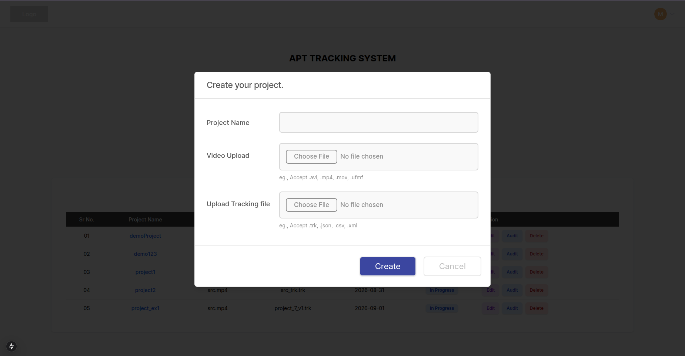
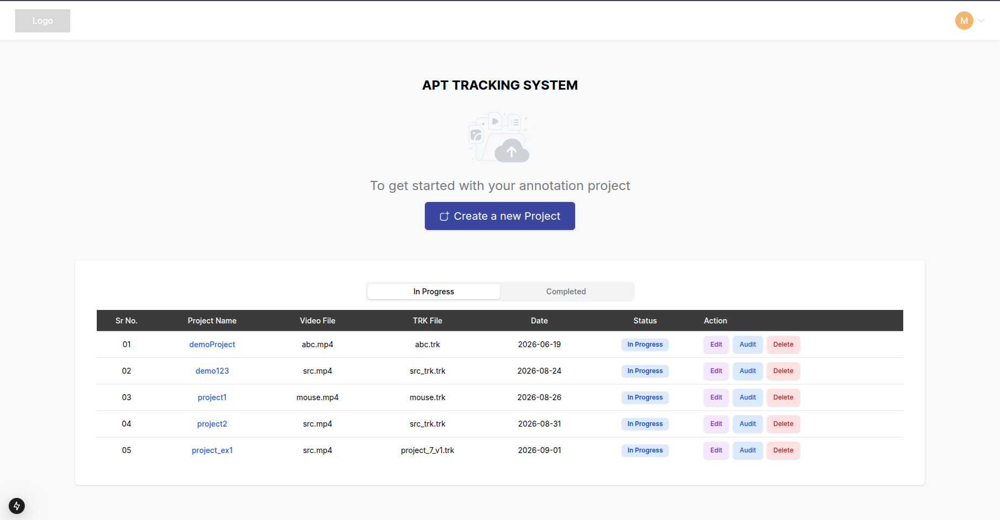

# APT Utility Website – User Guide

APT Utility Website helps you review animal tracking data alongside its source video. You can inspect tracked objects, correct trajectory mistakes, navigate suspicious areas, and export the updated tracking file.

> For installation, configuration, and development information, see the [Developer README](../README.md).

## Table of contents

- [Getting started](#getting-started)
- [Managing projects](#managing-projects)
- [Dashboard overview](#dashboard-overview)
- [Selecting objects](#selecting-objects)
- [Trajectory operations](#trajectory-operations)
- [Smart features](#smart-features)
- [Video controls](#video-controls)
- [Timeline](#timeline)
- [Keyboard shortcuts](#keyboard-shortcuts)
- [Exporting data](#exporting-data)
- [Troubleshooting](#troubleshooting)
- [Tips](#tips)

## Getting started

The application combines a video with its tracking data. After opening a project, you can:

- Review object IDs, keypoints, skeletons, bounding boxes, and trajectory trails.
- Select tracked objects from the video, object list, tables, or keyboard.
- Link, swap, break, delete, interpolate, and clip trajectories.
- Navigate trajectory breaks and large missing-frame gaps.
- Review linking and clipping suggestions generated by the backend.
- Browse trajectories by length and inspect confusion data.
- Export corrected tracking data.

## Managing projects

### Create a project

1. Open the landing page.
2. Click **Create Project**.
3. Enter a project name.
4. Choose a file under **Video Upload**.
5. Optionally choose a tracking file.
6. Click **Create** and wait for processing to finish.

The interface lists `.avi`, `.mp4`, `.mov`, and `.ufmf` as video examples, and `.trk`, `.json`, `.csv`, and `.xml` as tracking examples. Actual file support is determined by the backend.

### Open, delete, or audit a project

Projects are grouped by processing status on the landing page. Open a processed project to enter its dashboard. The original video and tracking filenames are displayed with the project.

- Open **Audit Log** to review recorded trajectory operations.
- Use the project’s delete action and confirm to remove it.

> Always open the dashboard from a project row. Opening `/dashboard` directly may leave required project information unavailable.

## Dashboard overview

The dashboard has three main areas:

1. **Sidebar** — project information, selected objects, operation buttons, clip range, and object list.
2. **Video workspace** — playback, annotations, trajectory overlays, suggestions, zoom, pan, and display settings.
3. **Timeline** — coordinate charts, object ranges, current frame, clip/gap highlights, and timeline modes.

The sidebar is resizable. Drag its divider to change its width, or double-click the divider to reset it.

## Selecting objects

Most operations require one or two selected objects. Selected objects appear in the sidebar as **Object 1** and **Object 2**.

### Select from the video

- Click an annotated object to select it as Object 1.
- Hold `Ctrl` while clicking to place an object in Object 2 where supported.
- Click an already selected annotation to remove it.

### Select with number keys

- Press `1`–`9` or `0` to select a visible object as Object 1.
- Press `Ctrl+1`–`Ctrl+9` or `Ctrl+0` to select it as Object 2.
- Assignments include only objects visible in the current zoomed and panned viewport.
- Press `Shift` to cycle shortcut pages when more than ten objects are visible.

### Other selection tools

- Open **Object Selection**, or press `O`, to view shortcut assignments.
- Press `Tab` to cycle Object 1.
- Press `Caps Lock` to cycle Object 2 when two objects are selected.
- Use **Clear** or `Backspace` to remove selections.
- Unique IDs and Confusion views can jump to relevant frames.

> `Backspace` clears an active clip range before clearing Object 2 and the remaining selection.

## Trajectory operations

Operations are available from the sidebar and keyboard. Confirmation dialogs are used for ambiguous or destructive actions.

### Link

**What it does:** Combines two trajectory segments that belong to the same animal.

**How to use it:**

1. Select two objects.
2. Click **Link** or press `L`.
3. If their frame ranges overlap, choose which object ID to preserve and confirm.

Non-overlapping trajectories link immediately. With one selected object, press `E` to jump to its end and select the best nearby continuation as Object 2. Review it, then press `L`.

**Shortcut:** `L`

### Swap

**What it does:** Exchanges the tracking IDs or assignments of two trajectories.

1. Select exactly two objects.
2. Click **Swap** or press `W`.
3. Review and confirm.

**Shortcut:** `W`

### Break

**What it does:** Splits one trajectory around the current frame.

1. Select exactly one object.
2. Navigate to the desired frame.
3. Click **Break** or press `B`.
4. Choose whether to break before or after the current frame.
5. Confirm the operation.

**Shortcut:** `B`

### Delete

**What it does:** Removes the selected trajectory.

1. Select exactly one object.
2. Click **Delete** or press `D`.
3. Confirm the operation.

**Shortcut:** `D`

### Interpolate

**What it does:** Fills missing tracking positions within one trajectory or between two compatible trajectory segments.

- With one selected object, click **Interpolate** or press `I` to interpolate within its frame range.
- With two selected objects, use the same action to interpolate from the source ending region to the target starting region.

**Shortcut:** `I`

### Clip

**What it does:** Removes a selected frame interval from one trajectory.

1. Select exactly one object.
2. Go to the first frame and press `Ctrl+C`.
3. Go to the final frame and press `Ctrl+C` again.
4. Review the purple timeline highlight.
5. Press `X` or click **Clip**.
6. Confirm the operation.

The interval must be inside the selected object’s frame range. The resulting track is selected after success.

**Shortcuts:** `Ctrl+C` captures the two boundaries. `X` opens the Clip confirmation for the selected range.

### Confusion, undo, redo, and refresh

- Click **Confusion** or press `R` to recalculate confusion. The backend processes it asynchronously.
- Use the undo and redo buttons for supported operations.
- Press `Ctrl+R` or choose **Refresh Data** to reload dashboard data.
- Successful operations refresh affected annotations and timelines.

## Smart features

### Break navigation and linking suggestions

Select an object and press `.` to navigate forward through its break boundaries. Press `,` to return to a previously visited boundary.

At a valid mid-trajectory break, the video displays up to five ranked trajectory matches with confidence percentages. Suggestions are skipped at frame `0` or the object’s first frame because no preceding segment exists to link.

Select a **Top Matches** row to keep the current trajectory as Object 1 and select the suggested trajectory as Object 2. Review both selections, then press `L` to link them.

### Automatic continuation matching

With one object selected, press `E`. The application:

1. Jumps to the object’s end frame.
2. Finds trajectories starting shortly afterward.
3. Removes spatially distant candidates.
4. Ranks valid candidates by frame proximity and coordinate distance.
5. Selects the top result as Object 2.

The **Next Link Matches** panel remains visible after the top result is selected. Select any row to replace Object 2 with that candidate, then review both objects and press `L` to link them.

### Clip suggestions

With exactly one selected object, the backend identifies suspicious movement intervals that may need clipping.

- Suggestions appear in the fixed-width **Clip Suggestions** panel.
- Each row shows the interval and score.
- Selecting a row prepares its clip range and jumps to its peak-movement frame.
- It does not clip automatically; confirm using the normal **Clip** workflow.

### Largest-gap navigation

Select one object and press `G` to browse missing-frame gaps from largest to smallest.

- The video jumps to the gap start.
- A toast shows its rank, size, and boundaries.
- The interval is highlighted in amber on the timeline.
- Repeated presses cycle through all returned gaps.

### Browse by trajectory length

1. Open the top-right menu.
2. Choose **Browse by Length**.
3. Choose **Longest to Shortest** or **Shortest to Longest**.
4. Select a row to choose the trajectory and jump to its first frame.

Each row shows the object ID and trajectory length in frames.

### Confusion and Unique IDs

- Press `C` to open the Confusion table.
- Press `M` to open the Unique IDs table.
- Use their available filtering, sorting, inspection, and frame-jump controls.

## Video controls

### Playback and navigation

- Play or pause from the controls, with `Space`, or with `P`.
- Use `←` and `→` for one-frame steps.
- Use `↑` and `↓` to move forward or backward ten frames.
- Click or drag the timeline to jump to a frame.
- Enter a frame number for direct navigation.
- Use the logarithmic playback-speed control to change speed.
- Source FPS, effective FPS, current frame, and time are displayed where applicable.

### Zoom, pan, and overlays

- Zoom with the controls or `=` and `-`.
- Toggle edge-aware auto-pan with `A`.
- Toggle trajectory trails with `T` and configure their length in frames from the menu.
- Toggle 3× bounding-box scale with `Z`.
- Toggle skeleton rendering with `K`.
- Switch between light and dark annotation color palettes from the menu.

## Timeline

The timeline supports object X, object Y, combined object X/Y, skeleton-point X, skeleton-point Y, and combined skeleton X/Y modes.

Skeleton data loads only in skeleton modes. Clearing the object selection removes both normal and skeleton trajectory lines.

| Color or marker | Meaning |
| --- | --- |
| Purple range | Captured clip interval. |
| Amber range | Missing-frame gap selected with `G`. |
| Red marker | Current video frame. |
| Object-range markers | Trajectory starts and ends in the visible window. |

## Keyboard shortcuts

Shortcuts are ignored while typing in inputs, and operation shortcuts are generally disabled while dialogs are open.

### Playback and navigation

| Shortcut | Action |
| --- | --- |
| `Space` / `P` | Play or pause. |
| `←` / `→` | Previous or next frame. |
| `↑` / `↓` | Jump forward or backward ten frames. |
| `S` | Go to the selected object’s start. |
| `E` | Go to its end and select the top continuation. |
| `G` | Go to the next-largest trajectory gap. |
| `.` | Go to the next break boundary. |
| `,` | Return to the previous visited boundary. |

### Object selection

| Shortcut | Action |
| --- | --- |
| `1`–`9`, `0` | Select a visible object as Object 1. |
| `Ctrl+1`–`Ctrl+9`, `Ctrl+0` | Select a visible object as Object 2. |
| `Tab` | Cycle Object 1. |
| `Caps Lock` | Cycle Object 2. |
| `Shift` | Cycle visible-object shortcut pages. |
| `Backspace` | Clear clip range, Object 2, then the remaining selection. |

### View controls and panels

| Shortcut | Action |
| --- | --- |
| `=` / `-` | Zoom in or out. |
| `T` | Toggle trajectory trails. |
| `A` | Toggle auto-pan. |
| `Z` | Toggle 3× bounding-box scale. |
| `K` | Toggle skeletons. |
| `M` | Open Unique IDs. |
| `C` | Open Confusion. |
| `O` | Toggle the visible-object selection guide. |
| `?` | Open the shortcut reference. |

### Operations

| Shortcut | Action |
| --- | --- |
| `Ctrl+C` | Capture clip start or end. |
| `X` | Open Clip confirmation for the selected range. |
| `L` | Link selected objects or the top continuation. |
| `W` | Open Swap confirmation. |
| `B` | Open Break confirmation. |
| `D` | Open Delete confirmation. |
| `I` | Interpolate selected object or objects. |
| `R` | Recalculate confusion. |
| `Ctrl+R` | Refresh dashboard data. |
| `Enter` | Confirm a supported open operation dialog. |

## Exporting data

1. Open the top-right dashboard menu.
2. Choose **Export TRK**.
3. Save the updated tracking file when the download begins.
